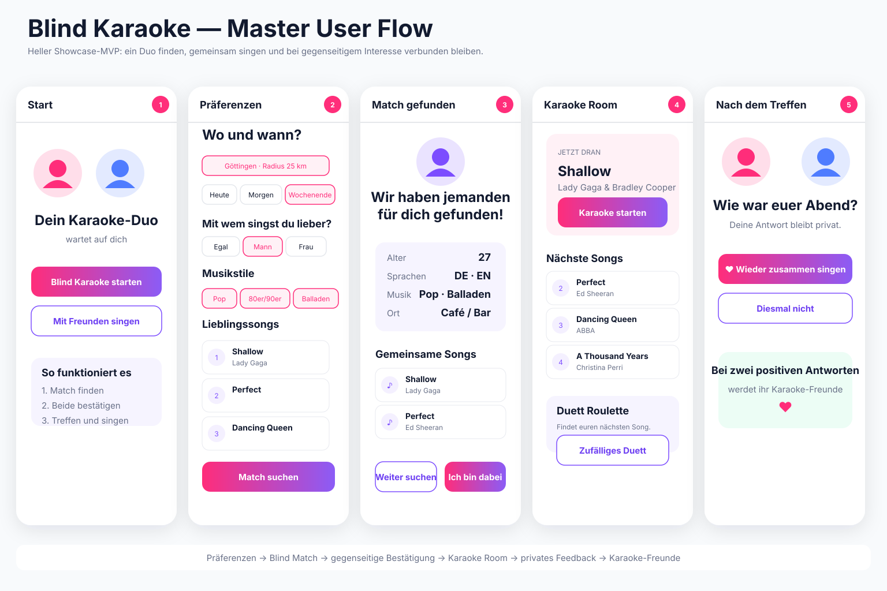

# Blind Karaoke

**Blind Karaoke** is a mobile-first social karaoke webapp that connects two people from the same city for a real karaoke evening.

## Delivery 1

The showcase MVP focuses on one complete flow:

**Preferences → blind match → mutual confirmation → shared Karaoke Room → private post-karaoke feedback → Karaoke Friends**

There is deliberately no public profile directory, swipe feed, social feed, in-app chat, AI/LLM dependency, pitch detection, or hosted lyrics/audio in Delivery 1.

## Stack

- React + TypeScript
- Firebase Anonymous Authentication
- Cloud Firestore + realtime listeners
- Responsive mobile-first UI

## Repository map

- [SPEC.md](SPEC.md) — current product/spec baseline
- [ROADMAP.md](ROADMAP.md) — delivery status and future work
- [docs/PROJECT_PRD.md](docs/PROJECT_PRD.md) — product PRD
- [docs/DELIVERY_1.md](docs/DELIVERY_1.md) — exact Delivery 1 scope
- [docs/ARCHITECTURE.md](docs/ARCHITECTURE.md) — component/data design
- [prompts/DELIVERY_1_AISTUDIO_BUILD.md](prompts/DELIVERY_1_AISTUDIO_BUILD.md) — copy-ready AI Studio Build implementation prompt
- [design/](design/) — accepted/current light UI references
- [qa/](qa/) — acceptance matrix, test data and browser QA plan

## Design direction

Bright, clean, mostly white UI with restrained pink/purple accents, large touch targets, rounded cards and minimal visual noise. `wfwebapp` is the workflow name only and must never appear as product branding or visible UI text.

## Current status

Planning assets for Delivery 1 are complete. Implementation and deployed-app QA are the next steps.

> The files in `design/*.svg` are current concept/mockup graphics. Real screenshots of the deployed app will be stored in `design/screenshots/` after implementation and browser QA.
